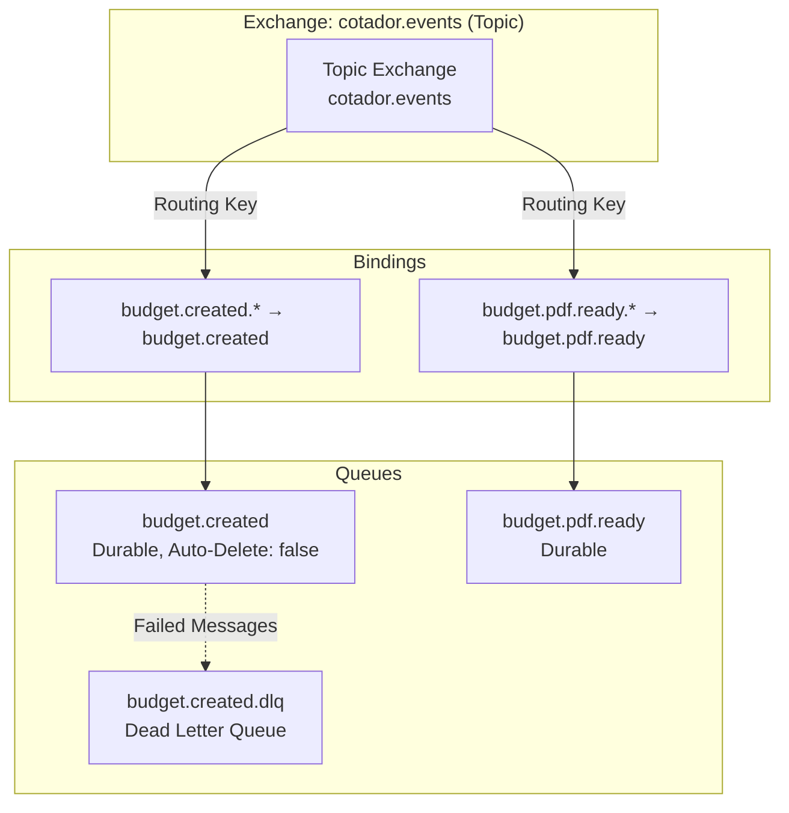

# Plano de Desenvolvimento: Integração de Mensageria e Worker de PDF
## Cotador Enterprise - Sprint 2: Mensageria

**Versão**: 1.0  
**Data**: 2025-01-17  
**Autor**: Tech Lead / Senior Software Architect

---

## Índice

1. [Arquitetura do Evento (O Contrato)](#1-arquitetura-do-evento-o-contrato)
2. [Implementação no API Core (Producer)](#2-implementação-no-api-core-producer)
3. [Implementação no Micro-PDF (Worker/Consumer)](#3-implementação-no-micro-pdf-workerconsumer)
4. [Infraestrutura e Filas (Low Level Setup)](#4-infraestrutura-e-filas-low-level-setup)
5. [Cards de Tarefas (Backlog Técnico)](#5-cards-de-tarefas-backlog-técnico)

---

## 1. Arquitetura do Evento (O Contrato)

### 1.1 Definição do Payload

O evento `BudgetCreatedEvent` será publicado na fila `budget.created` sempre que um orçamento for criado com sucesso no banco de dados.

#### 1.1.1 Estrutura JSON do Evento

```json
{
  "eventId": "550e8400-e29b-41d4-a716-446655440000",
  "eventType": "BudgetCreated",
  "aggregateId": "123e4567-e89b-12d3-a456-426614174000",
  "tenantId": "tenant-abc-123",
  "occurredAt": "2025-01-17T10:30:00.123Z",
  "version": "1.0",
  "payload": {
    "budgetId": "123e4567-e89b-12d3-a456-426614174000",
    "clientName": "Acme Corporation",
    "total": 15000.50,
    "status": "draft",
    "items": [
      {
        "id": "item-1",
        "description": "Desenvolvimento de API",
        "unitPrice": 5000.00,
        "quantity": 2
      },
      {
        "id": "item-2",
        "description": "Consultoria Técnica",
        "unitPrice": 5000.50,
        "quantity": 1
      }
    ],
    "createdAt": "2025-01-17T10:30:00.123Z"
  },
  "metadata": {
    "userId": "user-xyz-789",
    "correlationId": "corr-123",
    "source": "api-core",
    "traceId": "trace-456"
  }
}
```

#### 1.1.2 Schema TypeScript (Contrato Compartilhado)

**Localização**: `packages/shared/src/events/budget-created.event.ts`

```typescript
/**
 * Evento de Domínio: BudgetCreated
 * 
 * Publicado quando um orçamento é criado com sucesso.
 * Consumido pelo micro-pdf para gerar documento PDF.
 */
export interface BudgetItemPayload {
  id: string;
  description: string;
  unitPrice: number;
  quantity: number;
}

export interface BudgetCreatedPayload {
  budgetId: string;
  clientName: string;
  total: number;
  status: 'draft' | 'approved' | 'rejected';
  items: BudgetItemPayload[];
  createdAt: string; // ISO 8601
}

export interface EventMetadata {
  userId?: string;
  correlationId?: string;
  source: string;
  traceId?: string;
}

export interface BudgetCreatedEvent {
  eventId: string; // UUID único do evento
  eventType: 'BudgetCreated';
  aggregateId: string; // ID do orçamento
  tenantId: string;
  occurredAt: string; // ISO 8601
  version: string; // Versão do schema do evento
  payload: BudgetCreatedPayload;
  metadata: EventMetadata;
}

/**
 * Validação do evento usando Zod (opcional, mas recomendado)
 */
import { z } from 'zod';

export const BudgetItemPayloadSchema = z.object({
  id: z.string().uuid(),
  description: z.string().min(1),
  unitPrice: z.number().positive(),
  quantity: z.number().int().positive(),
});

export const BudgetCreatedPayloadSchema = z.object({
  budgetId: z.string().uuid(),
  clientName: z.string().min(1),
  total: z.number().nonnegative(),
  status: z.enum(['draft', 'approved', 'rejected']),
  items: z.array(BudgetItemPayloadSchema).min(1),
  createdAt: z.string().datetime(),
});

export const BudgetCreatedEventSchema = z.object({
  eventId: z.string().uuid(),
  eventType: z.literal('BudgetCreated'),
  aggregateId: z.string().uuid(),
  tenantId: z.string().min(1),
  occurredAt: z.string().datetime(),
  version: z.string(),
  payload: BudgetCreatedPayloadSchema,
  metadata: z.object({
    userId: z.string().optional(),
    correlationId: z.string().optional(),
    source: z.string(),
    traceId: z.string().optional(),
  }),
});
```

**Nota**: Em um monorepo, este contrato pode ser compartilhado via:
- Pacote npm interno (`@cotador/shared`)
- Subpasta `packages/shared` com path mapping no `tsconfig.json`
- Git submodule (não recomendado)

### 1.2 Contrato de Interface (Domain Events)

Seguindo o padrão **Domain Events** de Eric Evans, criamos uma abstração no domínio:

**Localização**: `apps/api-core/src/domain/events/domain-event.interface.ts`

```typescript
/**
 * Interface base para todos os eventos de domínio
 * 
 * Pattern: Domain Events (Eric Evans)
 * Garante que eventos são objetos de primeira classe no domínio
 */
export interface IDomainEvent {
  eventId: string;
  eventType: string;
  aggregateId: string;
  tenantId: string;
  occurredAt: Date;
  version: string;
  toJSON(): Record<string, any>;
}

/**
 * Implementação base abstrata
 */
export abstract class DomainEvent implements IDomainEvent {
  public readonly eventId: string;
  public readonly eventType: string;
  public readonly aggregateId: string;
  public readonly tenantId: string;
  public readonly occurredAt: Date;
  public readonly version: string;

  constructor(
    aggregateId: string,
    tenantId: string,
    eventType: string,
    version: string = '1.0',
  ) {
    this.eventId = crypto.randomUUID();
    this.aggregateId = aggregateId;
    this.tenantId = tenantId;
    this.eventType = eventType;
    this.version = version;
    this.occurredAt = new Date();
  }

  abstract toJSON(): Record<string, any>;
}
```

**Localização**: `apps/api-core/src/domain/events/budget-created.event.ts`

```typescript
import { DomainEvent } from './domain-event.interface';
import { Budget } from '../entities/budget.entity';

/**
 * Evento de Domínio: BudgetCreated
 * 
 * Representa o fato de que um orçamento foi criado.
 * Este evento é publicado após a persistência bem-sucedida.
 */
export class BudgetCreatedEvent extends DomainEvent {
  constructor(
    public readonly budget: Budget,
    public readonly tenantId: string,
    public readonly metadata?: {
      userId?: string;
      correlationId?: string;
      traceId?: string;
    },
  ) {
    super(budget.id, tenantId, 'BudgetCreated', '1.0');
  }

  toJSON(): Record<string, any> {
    return {
      eventId: this.eventId,
      eventType: this.eventType,
      aggregateId: this.aggregateId,
      tenantId: this.tenantId,
      occurredAt: this.occurredAt.toISOString(),
      version: this.version,
      payload: {
        budgetId: this.budget.id,
        clientName: this.budget.clientName,
        total: this.budget.total,
        status: this.budget.status,
        items: this.budget.items.map((item) => ({
          id: crypto.randomUUID(), // Ou usar ID persistido se disponível
          description: item.description,
          unitPrice: item.unitPrice,
          quantity: item.quantity,
        })),
        createdAt: this.budget.createdAt.toISOString(),
      },
      metadata: {
        userId: this.metadata?.userId,
        correlationId: this.metadata?.correlationId,
        source: 'api-core',
        traceId: this.metadata?.traceId,
      },
    };
  }
}
```

---

## 2. Implementação no API Core (Producer)

### 2.1 Camada de Infraestrutura: RmqModule

#### 2.1.1 Instalação de Dependências

```bash
cd apps/api-core
npm install @nestjs/microservices amqplib amqp-connection-manager
npm install --save-dev @types/amqplib
```

#### 2.1.2 Configuração do RabbitMQ Module

**Localização**: `apps/api-core/src/infra/messaging/rmq.module.ts`

```typescript
import { Module } from '@nestjs/common';
import { ClientsModule, Transport } from '@nestjs/microservices';
import { ConfigModule, ConfigService } from '@nestjs/config';

/**
 * RabbitMQ Module
 * 
 * Configura o ClientProxy para publicação de eventos.
 * Pattern: Module Pattern (NestJS)
 */
@Module({
  imports: [
    ClientsModule.registerAsync([
      {
        name: 'RABBITMQ_SERVICE',
        imports: [ConfigModule],
        useFactory: (configService: ConfigService) => ({
          transport: Transport.RMQ,
          options: {
            urls: [configService.get<string>('RABBITMQ_URL') || 'amqp://localhost:5672'],
            queue: 'budget.created',
            queueOptions: {
              durable: true, // Fila persiste após reinicialização do RabbitMQ
              arguments: {
                'x-message-ttl': 86400000, // TTL de 24 horas
                'x-dead-letter-exchange': 'cotador.dlx', // DLQ
                'x-dead-letter-routing-key': 'budget.created.dlq',
              },
            },
            socketOptions: {
              heartbeatIntervalInSeconds: 60,
              reconnectTimeInSeconds: 5,
            },
          },
        }),
        inject: [ConfigService],
      },
    ]),
  ],
  exports: [ClientsModule],
})
export class RmqModule {}
```

#### 2.1.3 Event Bus Interface (Domain Layer)

**Localização**: `apps/api-core/src/domain/events/event-bus.interface.ts`

```typescript
import { IDomainEvent } from './domain-event.interface';

/**
 * Interface do Event Bus
 * 
 * Pattern: Dependency Inversion Principle
 * O domínio define o contrato, a infraestrutura implementa
 */
export interface IEventBus {
  publish(event: IDomainEvent): Promise<void>;
  publishAll(events: IDomainEvent[]): Promise<void>;
}
```

#### 2.1.4 Implementação do Event Bus (Infrastructure Layer)

**Localização**: `apps/api-core/src/infra/messaging/rabbitmq-event-bus.service.ts`

```typescript
import { Injectable, Inject, Logger } from '@nestjs/common';
import { ClientProxy } from '@nestjs/microservices';
import { IEventBus } from '../../domain/events/event-bus.interface';
import { IDomainEvent } from '../../domain/events/domain-event.interface';
import { firstValueFrom, timeout } from 'rxjs';

/**
 * RabbitMQ Event Bus Implementation
 * 
 * Pattern: Adapter Pattern
 * Adapta o ClientProxy do NestJS para a interface IEventBus do domínio
 */
@Injectable()
export class RabbitMQEventBus implements IEventBus {
  private readonly logger = new Logger(RabbitMQEventBus.name);

  constructor(
    @Inject('RABBITMQ_SERVICE') private readonly client: ClientProxy,
  ) {}

  async publish(event: IDomainEvent): Promise<void> {
    try {
      const eventPayload = event.toJSON();
      
      // Publica no exchange com routing key baseado no tipo de evento
      const routingKey = this.getRoutingKey(event.eventType, event.tenantId);
      
      this.logger.debug(`Publishing event ${event.eventType}`, {
        eventId: event.eventId,
        aggregateId: event.aggregateId,
        routingKey,
      });

      // Usa send com pattern para publicar no exchange
      await firstValueFrom(
        this.client.send(routingKey, eventPayload).pipe(
          timeout(5000), // Timeout de 5 segundos
        ),
      );

      this.logger.log(`Event ${event.eventType} published successfully`, {
        eventId: event.eventId,
        aggregateId: event.aggregateId,
      });
    } catch (error) {
      this.logger.error(`Failed to publish event ${event.eventType}`, {
        eventId: event.eventId,
        error: error.message,
        stack: error.stack,
      });
      throw error;
    }
  }

  async publishAll(events: IDomainEvent[]): Promise<void> {
    await Promise.all(events.map((event) => this.publish(event)));
  }

  private getRoutingKey(eventType: string, tenantId: string): string {
    // Formato: event.type.tenantId
    // Exemplo: budget.created.tenant-abc-123
    return `${eventType.toLowerCase()}.${tenantId}`;
  }
}
```

**Nota**: O método `send` do ClientProxy do NestJS não funciona diretamente com exchanges. Precisamos usar uma abordagem diferente. Veja a seção 4.1 para a configuração correta.

### 2.2 Refatoração do Use Case

#### 2.2.1 Use Case Atualizado

**Localização**: `apps/api-core/src/application/use-cases/create-budget.use-case.ts`

```typescript
import { randomUUID } from 'node:crypto';
import { IBudgetRepository } from '../../domain/repositories/budget-repository.interface';
import { IEventBus } from '../../domain/events/event-bus.interface';
import { Budget, BudgetItem } from '../../domain/entities/budget.entity';
import { BudgetCreatedEvent } from '../../domain/events/budget-created.event';

interface CreateBudgetDto {
  tenantId: string;
  clientName: string;
  items: { description: string; price: number; qty: number }[];
  metadata?: {
    userId?: string;
    correlationId?: string;
    traceId?: string;
  };
}

/**
 * Create Budget Use Case
 * 
 * Pattern: Use Case Pattern (Clean Architecture)
 * Orquestra a criação de orçamento e publicação de eventos
 */
export class CreateBudgetUseCase {
  constructor(
    private budgetRepo: IBudgetRepository,
    private eventBus: IEventBus,
  ) {}

  async execute(input: CreateBudgetDto): Promise<Budget> {
    // 1. Validação de entrada (pode ser extraída para Value Objects)
    this.validateInput(input);

    // 2. Cálculo do total
    const total = input.items.reduce(
      (acc, item) => acc + item.price * item.qty,
      0,
    );

    // 3. Criação das entidades de domínio
    const itemsEntities = input.items.map(
      (i) => new BudgetItem(i.description, i.price, i.qty),
    );

    const budget = new Budget(
      randomUUID(),
      input.clientName,
      itemsEntities,
      total,
      'draft',
      new Date(),
    );

    // 4. Persistência no banco de dados (transação)
    await this.budgetRepo.save(budget);

    // 5. Publicação do evento de domínio (após persistência bem-sucedida)
    // Se a publicação falhar, o orçamento já está salvo (eventual consistency)
    try {
      const event = new BudgetCreatedEvent(budget, input.tenantId, input.metadata);
      await this.eventBus.publish(event);
    } catch (error) {
      // Log do erro, mas não falha a operação
      // Pattern: Best Effort Publishing
      // Em produção, implementar Outbox Pattern para garantir entrega
      console.error('Failed to publish BudgetCreatedEvent', error);
      // TODO: Implementar Outbox Pattern (ver seção 2.3)
    }

    return budget;
  }

  private validateInput(input: CreateBudgetDto): void {
    if (!input.tenantId) {
      throw new Error('TenantId is required');
    }
    if (!input.clientName || input.clientName.trim().length === 0) {
      throw new Error('ClientName is required');
    }
    if (!input.items || input.items.length === 0) {
      throw new Error('At least one item is required');
    }
    input.items.forEach((item, index) => {
      if (!item.description || item.description.trim().length === 0) {
        throw new Error(`Item ${index + 1}: description is required`);
      }
      if (item.price <= 0) {
        throw new Error(`Item ${index + 1}: price must be positive`);
      }
      if (item.qty <= 0) {
        throw new Error(`Item ${index + 1}: quantity must be positive`);
      }
    });
  }
}
```

#### 2.2.2 Atualização do BudgetModule

**Localização**: `apps/api-core/src/infra/modules/budget.module.ts`

```typescript
import { Module } from '@nestjs/common';
import { BudgetController } from '../controllers/budget.controller';
import { CreateBudgetUseCase } from '../../application/use-cases/create-budget.use-case';
import { PrismaService } from '../database/prisma/prisma.service';
import { PrismaBudgetRepository } from '../database/repositories/prisma-budget.repository';
import { RmqModule } from '../messaging/rmq.module';
import { RabbitMQEventBus } from '../messaging/rabbitmq-event-bus.service';
import { IEventBus } from '../../domain/events/event-bus.interface';

@Module({
  imports: [RmqModule],
  controllers: [BudgetController],
  providers: [
    PrismaService,
    {
      provide: 'IBudgetRepository',
      useClass: PrismaBudgetRepository,
    },
    {
      provide: 'IEventBus',
      useClass: RabbitMQEventBus,
    },
    {
      provide: CreateBudgetUseCase,
      useFactory: (
        repo: PrismaBudgetRepository,
        eventBus: RabbitMQEventBus,
      ) => new CreateBudgetUseCase(repo, eventBus),
      inject: ['IBudgetRepository', 'IEventBus'],
    },
    PrismaBudgetRepository,
    RabbitMQEventBus,
  ],
})
export class BudgetModule {}
```

### 2.3 Tratamento de Falhas: Outbox Pattern Simplificado

#### 2.3.1 Problema

Se o banco salvar com sucesso mas o RabbitMQ estiver fora, perdemos o evento. O **Outbox Pattern** resolve isso garantindo que eventos sejam publicados eventualmente.

#### 2.3.2 Implementação Simplificada

**Passo 1: Adicionar tabela Outbox no Prisma**

**Localização**: `apps/api-core/prisma/schema.prisma`

```prisma
model OutboxEvent {
  id            String   @id @default(uuid())
  eventType     String
  aggregateId   String
  tenantId      String
  payload       Json     // Evento serializado
  status        String   @default("pending") // pending, published, failed
  retryCount    Int      @default(0)
  lastError     String?
  createdAt     DateTime @default(now())
  publishedAt   DateTime?

  @@index([status, createdAt])
  @@index([tenantId])
  @@map("outbox_events")
}
```

**Passo 2: Outbox Repository**

**Localização**: `apps/api-core/src/infra/messaging/outbox.repository.ts`

```typescript
import { Injectable } from '@nestjs/common';
import { PrismaService } from '../database/prisma/prisma.service';
import { IDomainEvent } from '../../domain/events/domain-event.interface';

@Injectable()
export class OutboxRepository {
  constructor(private prisma: PrismaService) {}

  async save(event: IDomainEvent): Promise<void> {
    await this.prisma.outboxEvent.create({
      data: {
        eventType: event.eventType,
        aggregateId: event.aggregateId,
        tenantId: event.tenantId,
        payload: event.toJSON(),
        status: 'pending',
      },
    });
  }

  async findPending(limit: number = 100): Promise<any[]> {
    return this.prisma.outboxEvent.findMany({
      where: {
        status: 'pending',
        retryCount: { lt: 5 }, // Máximo de 5 tentativas
      },
      orderBy: {
        createdAt: 'asc',
      },
      take: limit,
    });
  }

  async markAsPublished(id: string): Promise<void> {
    await this.prisma.outboxEvent.update({
      where: { id },
      data: {
        status: 'published',
        publishedAt: new Date(),
      },
    });
  }

  async markAsFailed(id: string, error: string): Promise<void> {
    await this.prisma.outboxEvent.update({
      where: { id },
      data: {
        status: 'failed',
        lastError: error,
        retryCount: { increment: 1 },
      },
    });
  }
}
```

**Passo 3: Use Case com Outbox**

```typescript
// Refatoração do CreateBudgetUseCase
async execute(input: CreateBudgetDto): Promise<Budget> {
  // ... criação do budget ...

  // Transação: salva budget E evento no outbox
  await this.prisma.$transaction(async (tx) => {
    // Salva budget
    await tx.budget.create({ /* ... */ });
    
    // Salva evento no outbox (na mesma transação)
    const event = new BudgetCreatedEvent(budget, input.tenantId, input.metadata);
    await tx.outboxEvent.create({
      data: {
        eventType: event.eventType,
        aggregateId: event.aggregateId,
        tenantId: event.tenantId,
        payload: event.toJSON(),
        status: 'pending',
      },
    });
  });

  // Tenta publicar imediatamente (best effort)
  try {
    const event = new BudgetCreatedEvent(budget, input.tenantId, input.metadata);
    await this.eventBus.publish(event);
    // Se sucesso, marca como publicado (opcional, pode deixar para o worker)
  } catch (error) {
    // Evento está no outbox, será processado pelo OutboxProcessor
  }

  return budget;
}
```

**Passo 4: Outbox Processor (Background Job)**

**Localização**: `apps/api-core/src/infra/messaging/outbox-processor.service.ts`

```typescript
import { Injectable, Logger } from '@nestjs/common';
import { Cron, CronExpression } from '@nestjs/schedule';
import { OutboxRepository } from './outbox.repository';
import { RabbitMQEventBus } from './rabbitmq-event-bus.service';

/**
 * Outbox Processor
 * 
 * Pattern: Background Job Pattern
 * Processa eventos pendentes no outbox periodicamente
 */
@Injectable()
export class OutboxProcessor {
  private readonly logger = new Logger(OutboxProcessor.name);

  constructor(
    private outboxRepo: OutboxRepository,
    private eventBus: RabbitMQEventBus,
  ) {}

  @Cron(CronExpression.EVERY_10_SECONDS) // Executa a cada 10 segundos
  async processPendingEvents() {
    const pendingEvents = await this.outboxRepo.findPending(100);

    for (const outboxEvent of pendingEvents) {
      try {
        // Publica o evento
        await this.eventBus.publishRaw(outboxEvent.payload);
        
        // Marca como publicado
        await this.outboxRepo.markAsPublished(outboxEvent.id);
        
        this.logger.debug(`Published outbox event ${outboxEvent.id}`);
      } catch (error) {
        this.logger.error(`Failed to publish outbox event ${outboxEvent.id}`, error);
        await this.outboxRepo.markAsFailed(outboxEvent.id, error.message);
      }
    }
  }
}
```

**Nota**: Para produção, considere usar **Debezium** ou **AWS DMS** para capturar mudanças no outbox via CDC (Change Data Capture).

---

## 3. Implementação no Micro-PDF (Worker/Consumer)

### 3.1 Bootstrap do Serviço

#### 3.1.1 Estrutura do Projeto

```
apps/
└── micro-pdf/
    ├── package.json
    ├── tsconfig.json
    ├── nest-cli.json
    ├── src/
    │   ├── main.ts
    │   ├── app.module.ts
    │   ├── domain/
    │   │   └── events/
    │   │       └── budget-created.event.ts (shared)
    │   ├── application/
    │   │   └── use-cases/
    │   │       └── generate-pdf.use-case.ts
    │   └── infra/
    │       ├── consumers/
    │       │   └── budget-created.consumer.ts
    │       ├── storage/
    │       │   └── s3-storage.service.ts
    │       └── pdf/
    │           └── pdf-generator.service.ts
```

#### 3.1.2 Package.json

**Localização**: `apps/micro-pdf/package.json`

```json
{
  "name": "micro-pdf",
  "version": "0.0.1",
  "private": true,
  "scripts": {
    "start": "nest start",
    "start:dev": "nest start --watch",
    "start:prod": "node dist/main",
    "build": "nest build"
  },
  "dependencies": {
    "@nestjs/common": "^11.0.1",
    "@nestjs/core": "^11.0.1",
    "@nestjs/microservices": "^11.0.1",
    "@aws-sdk/client-s3": "^3.0.0",
    "puppeteer": "^21.0.0",
    "rxjs": "^7.8.1"
  }
}
```

#### 3.1.3 Main.ts (Microservice Bootstrap)

**Localização**: `apps/micro-pdf/src/main.ts`

```typescript
import { NestFactory } from '@nestjs/core';
import { MicroserviceOptions, Transport } from '@nestjs/microservices';
import { AppModule } from './app.module';
import { Logger } from '@nestjs/common';

/**
 * Bootstrap do Microservice
 * 
 * Pattern: Microservice Pattern (NestJS)
 * Configurado apenas para receber mensagens via RabbitMQ
 */
async function bootstrap() {
  const logger = new Logger('Bootstrap');

  const app = await NestFactory.createMicroservice<MicroserviceOptions>(
    AppModule,
    {
      transport: Transport.RMQ,
      options: {
        urls: [process.env.RABBITMQ_URL || 'amqp://localhost:5672'],
        queue: 'budget.created',
        queueOptions: {
          durable: true,
          arguments: {
            'x-message-ttl': 86400000,
            'x-dead-letter-exchange': 'cotador.dlx',
            'x-dead-letter-routing-key': 'budget.created.dlq',
          },
        },
        socketOptions: {
          heartbeatIntervalInSeconds: 60,
          reconnectTimeInSeconds: 5,
        },
        // Prefetch: processa uma mensagem por vez por worker
        prefetchCount: 1,
      },
    },
  );

  app.useLogger(logger);

  await app.listen();
  logger.log('Micro-PDF Worker is listening for messages');
}

bootstrap();
```

#### 3.1.4 App Module

**Localização**: `apps/micro-pdf/src/app.module.ts`

```typescript
import { Module } from '@nestjs/common';
import { ConfigModule } from '@nestjs/config';
import { BudgetCreatedConsumer } from './infra/consumers/budget-created.consumer';
import { GeneratePdfUseCase } from './application/use-cases/generate-pdf.use-case';
import { PdfGeneratorService } from './infra/pdf/pdf-generator.service';
import { S3StorageService } from './infra/storage/s3-storage.service';
import { IStorageService } from './domain/storage/storage.interface';

@Module({
  imports: [ConfigModule.forRoot()],
  controllers: [BudgetCreatedConsumer],
  providers: [
    {
      provide: 'IStorageService',
      useClass: S3StorageService,
    },
    {
      provide: GeneratePdfUseCase,
      useFactory: (
        pdfGenerator: PdfGeneratorService,
        storage: S3StorageService,
      ) => new GeneratePdfUseCase(pdfGenerator, storage),
      inject: [PdfGeneratorService, 'IStorageService'],
    },
    PdfGeneratorService,
    S3StorageService,
  ],
})
export class AppModule {}
```

### 3.2 Domain Logic no Worker

#### 3.2.1 Use Case: Generate PDF

**Localização**: `apps/micro-pdf/src/application/use-cases/generate-pdf.use-case.ts`

```typescript
import { Injectable, Logger } from '@nestjs/common';
import { PdfGeneratorService } from '../../infra/pdf/pdf-generator.service';
import { IStorageService } from '../../domain/storage/storage.interface';
import { BudgetCreatedEvent } from '../../domain/events/budget-created.event';

/**
 * Generate PDF Use Case
 * 
 * Pattern: Use Case Pattern
 * Orquestra a geração de PDF e upload para storage
 */
@Injectable()
export class GeneratePdfUseCase {
  private readonly logger = new Logger(GeneratePdfUseCase.name);

  constructor(
    private pdfGenerator: PdfGeneratorService,
    private storage: IStorageService,
  ) {}

  async execute(event: BudgetCreatedEvent): Promise<string> {
    this.logger.log(`Generating PDF for budget ${event.payload.budgetId}`);

    try {
      // 1. Gera PDF em memória (Buffer)
      const pdfBuffer = await this.pdfGenerator.generate(event.payload);

      // 2. Upload para S3/Azure Blob
      const fileName = `budgets/${event.tenantId}/${event.payload.budgetId}.pdf`;
      const url = await this.storage.upload(fileName, pdfBuffer, {
        contentType: 'application/pdf',
        metadata: {
          budgetId: event.payload.budgetId,
          tenantId: event.tenantId,
        },
      });

      this.logger.log(`PDF uploaded successfully: ${url}`);

      return url;
    } catch (error) {
      this.logger.error(`Failed to generate PDF for budget ${event.payload.budgetId}`, error);
      throw error;
    }
  }
}
```

#### 3.2.2 PDF Generator Service

**Localização**: `apps/micro-pdf/src/infra/pdf/pdf-generator.service.ts`

```typescript
import { Injectable, Logger } from '@nestjs/common';
import * as puppeteer from 'puppeteer';
import { BudgetCreatedPayload } from '../../domain/events/budget-created.event';

/**
 * PDF Generator Service
 * 
 * Usa Puppeteer para gerar PDFs a partir de HTML templates
 */
@Injectable()
export class PdfGeneratorService {
  private readonly logger = new Logger(PdfGeneratorService.name);

  async generate(payload: BudgetCreatedPayload): Promise<Buffer> {
    const browser = await puppeteer.launch({
      headless: true,
      args: ['--no-sandbox', '--disable-setuid-sandbox'],
    });

    try {
      const page = await browser.newPage();
      
      // Renderiza HTML do template
      const html = this.renderTemplate(payload);
      await page.setContent(html, { waitUntil: 'networkidle0' });

      // Gera PDF
      const pdfBuffer = await page.pdf({
        format: 'A4',
        printBackground: true,
        margin: {
          top: '20mm',
          right: '15mm',
          bottom: '20mm',
          left: '15mm',
        },
      });

      return Buffer.from(pdfBuffer);
    } finally {
      await browser.close();
    }
  }

  private renderTemplate(payload: BudgetCreatedPayload): string {
    // Template HTML simples (em produção, usar Handlebars/EJS)
    return `
      <!DOCTYPE html>
      <html>
        <head>
          <meta charset="UTF-8">
          <style>
            body { font-family: Arial, sans-serif; padding: 20px; }
            h1 { color: #333; }
            table { width: 100%; border-collapse: collapse; margin-top: 20px; }
            th, td { border: 1px solid #ddd; padding: 8px; text-align: left; }
            th { background-color: #f2f2f2; }
            .total { font-size: 18px; font-weight: bold; margin-top: 20px; }
          </style>
        </head>
        <body>
          <h1>Orçamento - ${payload.clientName}</h1>
          <p>Data: ${new Date(payload.createdAt).toLocaleDateString('pt-BR')}</p>
          <table>
            <thead>
              <tr>
                <th>Descrição</th>
                <th>Quantidade</th>
                <th>Preço Unitário</th>
                <th>Total</th>
              </tr>
            </thead>
            <tbody>
              ${payload.items.map(item => `
                <tr>
                  <td>${item.description}</td>
                  <td>${item.quantity}</td>
                  <td>R$ ${item.unitPrice.toFixed(2)}</td>
                  <td>R$ ${(item.unitPrice * item.quantity).toFixed(2)}</td>
                </tr>
              `).join('')}
            </tbody>
          </table>
          <div class="total">Total: R$ ${payload.total.toFixed(2)}</div>
        </body>
      </html>
    `;
  }
}
```

#### 3.2.3 Storage Service Interface (Domain)

**Localização**: `apps/micro-pdf/src/domain/storage/storage.interface.ts`

```typescript
export interface UploadOptions {
  contentType?: string;
  metadata?: Record<string, string>;
  acl?: 'private' | 'public-read';
}

export interface IStorageService {
  upload(fileName: string, buffer: Buffer, options?: UploadOptions): Promise<string>;
  delete(fileName: string): Promise<void>;
  getUrl(fileName: string): Promise<string>;
}
```

#### 3.2.4 S3 Storage Implementation

**Localização**: `apps/micro-pdf/src/infra/storage/s3-storage.service.ts`

```typescript
import { Injectable, Logger } from '@nestjs/common';
import { S3Client, PutObjectCommand, DeleteObjectCommand } from '@aws-sdk/client-s3';
import { getSignedUrl } from '@aws-sdk/s3-request-presigner';
import { IStorageService, UploadOptions } from '../../domain/storage/storage.interface';

@Injectable()
export class S3StorageService implements IStorageService {
  private readonly logger = new Logger(S3StorageService.name);
  private readonly s3Client: S3Client;
  private readonly bucketName: string;

  constructor() {
    this.bucketName = process.env.S3_BUCKET_NAME || 'cotador-documents';
    this.s3Client = new S3Client({
      region: process.env.AWS_REGION || 'us-east-1',
      credentials: {
        accessKeyId: process.env.AWS_ACCESS_KEY_ID || '',
        secretAccessKey: process.env.AWS_SECRET_ACCESS_KEY || '',
      },
    });
  }

  async upload(
    fileName: string,
    buffer: Buffer,
    options?: UploadOptions,
  ): Promise<string> {
    try {
      const command = new PutObjectCommand({
        Bucket: this.bucketName,
        Key: fileName,
        Body: buffer,
        ContentType: options?.contentType || 'application/pdf',
        Metadata: options?.metadata,
        ACL: options?.acl || 'private',
      });

      await this.s3Client.send(command);

      // Retorna URL pública ou signed URL
      const url = await this.getUrl(fileName);
      return url;
    } catch (error) {
      this.logger.error(`Failed to upload file ${fileName}`, error);
      throw error;
    }
  }

  async delete(fileName: string): Promise<void> {
    const command = new DeleteObjectCommand({
      Bucket: this.bucketName,
      Key: fileName,
    });

    await this.s3Client.send(command);
  }

  async getUrl(fileName: string): Promise<string> {
    // Se bucket é público, retorna URL direta
    if (process.env.S3_PUBLIC_BUCKET === 'true') {
      return `https://${this.bucketName}.s3.amazonaws.com/${fileName}`;
    }

    // Senão, gera signed URL (válida por 7 dias)
    const command = new PutObjectCommand({
      Bucket: this.bucketName,
      Key: fileName,
    });

    return await getSignedUrl(this.s3Client, command, { expiresIn: 604800 });
  }
}
```

### 3.3 Consumer (Message Handler)

**Localização**: `apps/micro-pdf/src/infra/consumers/budget-created.consumer.ts`

```typescript
import { Controller, Logger } from '@nestjs/common';
import { EventPattern, Payload, Ctx, RmqContext } from '@nestjs/microservices';
import { GeneratePdfUseCase } from '../../application/use-cases/generate-pdf.use-case';
import { BudgetCreatedEvent } from '../../domain/events/budget-created.event';

/**
 * Budget Created Consumer
 * 
 * Pattern: Message Handler Pattern
 * Consome eventos BudgetCreated e gera PDFs
 */
@Controller()
export class BudgetCreatedConsumer {
  private readonly logger = new Logger(BudgetCreatedConsumer.name);

  constructor(private generatePdfUseCase: GeneratePdfUseCase) {}

  @EventPattern('budget.created')
  async handleBudgetCreated(
    @Payload() event: BudgetCreatedEvent,
    @Ctx() context: RmqContext,
  ) {
    const channel = context.getChannelRef();
    const originalMsg = context.getMessage();

    this.logger.log(`Received BudgetCreated event: ${event.payload.budgetId}`);

    try {
      // Gera PDF e faz upload
      const pdfUrl = await this.generatePdfUseCase.execute(event);

      // TODO: Publicar evento BudgetPdfReady ou fazer webhook para API Core
      // await this.publishPdfReadyEvent(event.payload.budgetId, pdfUrl);

      // Acknowledge da mensagem (remove da fila)
      channel.ack(originalMsg);

      this.logger.log(`PDF generated successfully for budget ${event.payload.budgetId}`);
    } catch (error) {
      this.logger.error(
        `Failed to process BudgetCreated event: ${event.payload.budgetId}`,
        error,
      );

      // Rejeita mensagem e envia para DLQ após N tentativas
      channel.nack(originalMsg, false, false); // false, false = não reenfileirar
    }
  }
}
```

### 3.4 Feedback Loop: Evento BudgetPdfReady

#### 3.4.1 Publicação de Evento de Retorno

Após gerar o PDF, o worker publica um evento de volta para a API Core atualizar o orçamento:

**Localização**: `apps/micro-pdf/src/infra/messaging/rmq-publisher.service.ts`

```typescript
import { Injectable, Logger } from '@nestjs/common';
import { ClientProxy, ClientProxyFactory, Transport } from '@nestjs/microservices';

@Injectable()
export class RmqPublisherService {
  private readonly logger = new Logger(RmqPublisherService.name);
  private readonly client: ClientProxy;

  constructor() {
    this.client = ClientProxyFactory.create({
      transport: Transport.RMQ,
      options: {
        urls: [process.env.RABBITMQ_URL || 'amqp://localhost:5672'],
        queue: 'budget.pdf.ready',
        queueOptions: { durable: true },
      },
    });
  }

  async publishPdfReady(budgetId: string, tenantId: string, pdfUrl: string) {
    const event = {
      eventId: crypto.randomUUID(),
      eventType: 'BudgetPdfReady',
      aggregateId: budgetId,
      tenantId,
      occurredAt: new Date().toISOString(),
      payload: {
        budgetId,
        pdfUrl,
      },
    };

    await this.client.emit('budget.pdf.ready', event);
    this.logger.log(`Published BudgetPdfReady event for budget ${budgetId}`);
  }
}
```

#### 3.4.2 Consumer na API Core

**Localização**: `apps/api-core/src/infra/consumers/budget-pdf-ready.consumer.ts`

```typescript
import { Controller, Logger } from '@nestjs/common';
import { EventPattern, Payload, Ctx, RmqContext } from '@nestjs/microservices';
import { PrismaService } from '../database/prisma/prisma.service';

@Controller()
export class BudgetPdfReadyConsumer {
  private readonly logger = new Logger(BudgetPdfReadyConsumer.name);

  constructor(private prisma: PrismaService) {}

  @EventPattern('budget.pdf.ready')
  async handlePdfReady(
    @Payload() event: { payload: { budgetId: string; pdfUrl: string } },
    @Ctx() context: RmqContext,
  ) {
    const channel = context.getChannelRef();
    const originalMsg = context.getMessage();

    try {
      // Atualiza orçamento com URL do PDF
      await this.prisma.budget.update({
        where: { id: event.payload.budgetId },
        data: { pdfUrl: event.payload.pdfUrl },
      });

      this.logger.log(`Updated budget ${event.payload.budgetId} with PDF URL`);
      channel.ack(originalMsg);
    } catch (error) {
      this.logger.error(`Failed to update budget with PDF URL`, error);
      channel.nack(originalMsg, false, false);
    }
  }
}
```

---

## 4. Infraestrutura e Filas (Low Level Setup)

### 4.1 Topologia do RabbitMQ

#### 4.1.1 Exchange e Queues



#### 4.1.2 Script de Setup (RabbitMQ Management API)

**Localização**: `scripts/setup-rabbitmq.sh`

```bash
#!/bin/bash

RABBITMQ_URL="http://localhost:15672"
USERNAME="cotador_user"
PASSWORD="81Nw#I6+8an_"

# Cria Exchange
curl -u $USERNAME:$PASSWORD -X PUT \
  "$RABBITMQ_URL/api/exchanges/%2F/cotador.events" \
  -H "Content-Type: application/json" \
  -d '{
    "type": "topic",
    "durable": true,
    "auto_delete": false
  }'

# Cria Queue budget.created
curl -u $USERNAME:$PASSWORD -X PUT \
  "$RABBITMQ_URL/api/queues/%2F/budget.created" \
  -H "Content-Type: application/json" \
  -d '{
    "durable": true,
    "auto_delete": false,
    "arguments": {
      "x-message-ttl": 86400000,
      "x-dead-letter-exchange": "cotador.dlx",
      "x-dead-letter-routing-key": "budget.created.dlq"
    }
  }'

# Cria Queue budget.pdf.ready
curl -u $USERNAME:$PASSWORD -X PUT \
  "$RABBITMQ_URL/api/queues/%2F/budget.pdf.ready" \
  -H "Content-Type: application/json" \
  -d '{
    "durable": true,
    "auto_delete": false
  }'

# Cria Dead Letter Exchange
curl -u $USERNAME:$PASSWORD -X PUT \
  "$RABBITMQ_URL/api/exchanges/%2F/cotador.dlx" \
  -H "Content-Type: application/json" \
  -d '{
    "type": "topic",
    "durable": true
  }'

# Cria Dead Letter Queue
curl -u $USERNAME:$PASSWORD -X PUT \
  "$RABBITMQ_URL/api/queues/%2F/budget.created.dlq" \
  -H "Content-Type: application/json" \
  -d '{
    "durable": true,
    "auto_delete": false
  }'

# Bindings
curl -u $USERNAME:$PASSWORD -X POST \
  "$RABBITMQ_URL/api/bindings/%2F/e/cotador.events/q/budget.created" \
  -H "Content-Type: application/json" \
  -d '{
    "routing_key": "budget.created.*"
  }'

curl -u $USERNAME:$PASSWORD -X POST \
  "$RABBITMQ_URL/api/bindings/%2F/e/cotador.dlx/q/budget.created.dlq" \
  -H "Content-Type: application/json" \
  -d '{
    "routing_key": "budget.created.dlq"
  }'

echo "RabbitMQ topology configured successfully"
```

### 4.2 Resiliência: Retry Logic e DLQ

#### 4.2.1 Configuração de Retry no Consumer

**Localização**: `apps/micro-pdf/src/infra/consumers/budget-created.consumer.ts` (atualizado)

```typescript
@EventPattern('budget.created')
async handleBudgetCreated(
  @Payload() event: BudgetCreatedEvent,
  @Ctx() context: RmqContext,
) {
  const channel = context.getChannelRef();
  const originalMsg = context.getMessage();
  const retryCount = originalMsg.properties.headers['x-retry-count'] || 0;
  const maxRetries = 3;

  try {
    const pdfUrl = await this.generatePdfUseCase.execute(event);
    channel.ack(originalMsg);
  } catch (error) {
    if (retryCount < maxRetries) {
      // Reenfileira com delay exponencial
      const delay = Math.pow(2, retryCount) * 1000; // 1s, 2s, 4s
      
      setTimeout(() => {
        channel.nack(originalMsg, false, true); // true = reenfileirar
      }, delay);

      // Atualiza header de retry
      originalMsg.properties.headers['x-retry-count'] = retryCount + 1;
    } else {
      // Máximo de retries atingido, envia para DLQ
      this.logger.error(
        `Max retries reached for budget ${event.payload.budgetId}, sending to DLQ`,
      );
      channel.nack(originalMsg, false, false); // false = não reenfileirar (vai para DLQ)
    }
  }
}
```

#### 4.2.2 Monitoramento de DLQ

**Localização**: `scripts/monitor-dlq.sh`

```bash
#!/bin/bash

# Monitora tamanho da DLQ e envia alerta se > 10 mensagens
DLQ_SIZE=$(curl -s -u cotador_user:81Nw#I6+8an_ \
  "http://localhost:15672/api/queues/%2F/budget.created.dlq" | \
  jq '.messages')

if [ "$DLQ_SIZE" -gt 10 ]; then
  echo "ALERT: DLQ has $DLQ_SIZE messages"
  # Enviar notificação (Slack, PagerDuty, etc.)
fi
```

---

## 5. Cards de Tarefas (Backlog Técnico)

### Card 1: Configurar RabbitMQ Module no API Core

**Título**: Configurar RabbitMQ Module e Event Bus no API Core

**Contexto Técnico**:
- Implementar módulo NestJS para comunicação com RabbitMQ
- Criar abstração de Event Bus no domínio (IEventBus)
- Implementar RabbitMQEventBus na camada de infraestrutura
- Garantir que o domínio não conheça detalhes de implementação

**Arquivos a Modificar/Criar**:
- `apps/api-core/src/infra/messaging/rmq.module.ts` (CRIAR)
- `apps/api-core/src/domain/events/event-bus.interface.ts` (CRIAR)
- `apps/api-core/src/domain/events/domain-event.interface.ts` (CRIAR)
- `apps/api-core/src/infra/messaging/rabbitmq-event-bus.service.ts` (CRIAR)
- `apps/api-core/src/app.module.ts` (MODIFICAR - importar RmqModule)
- `apps/api-core/package.json` (MODIFICAR - adicionar dependências)

**Dependências**:
- `@nestjs/microservices`
- `amqplib`
- `amqp-connection-manager`

**Definição de Pronto (DoR/DoP)**:
- ✅ RmqModule configurado e exportando ClientProxy
- ✅ IEventBus interface criada no domínio
- ✅ RabbitMQEventBus implementando IEventBus
- ✅ Testes unitários para RabbitMQEventBus (mock do ClientProxy)
- ✅ Integração testada localmente (publicar evento e verificar no RabbitMQ Management)

**Padrões Aplicados**:
- Dependency Inversion Principle (DIP)
- Adapter Pattern
- Module Pattern (NestJS)

---

### Card 2: Criar Domain Events e Contrato Compartilhado

**Título**: Implementar Domain Events e Contrato de Eventos Compartilhado

**Contexto Técnico**:
- Criar abstração de Domain Event no domínio
- Implementar BudgetCreatedEvent como evento de domínio
- Criar contrato TypeScript compartilhado entre api-core e micro-pdf
- Garantir type-safety entre serviços

**Arquivos a Modificar/Criar**:
- `apps/api-core/src/domain/events/domain-event.interface.ts` (CRIAR)
- `apps/api-core/src/domain/events/budget-created.event.ts` (CRIAR)
- `packages/shared/src/events/budget-created.event.ts` (CRIAR - contrato compartilhado)
- `packages/shared/package.json` (CRIAR)
- `apps/api-core/tsconfig.json` (MODIFICAR - path mapping para @cotador/shared)
- `apps/micro-pdf/tsconfig.json` (MODIFICAR - path mapping para @cotador/shared)

**Definição de Pronto (DoR/DoP)**:
- ✅ DomainEvent interface abstrata criada
- ✅ BudgetCreatedEvent implementando DomainEvent
- ✅ Contrato TypeScript compartilhado em packages/shared
- ✅ Ambos os serviços importam o mesmo contrato
- ✅ Validação de schema (Zod) opcional implementada
- ✅ Testes unitários para BudgetCreatedEvent.toJSON()

**Padrões Aplicados**:
- Domain Events Pattern (Eric Evans)
- Shared Kernel (DDD)
- Value Object Pattern

---

### Card 3: Refatorar CreateBudgetUseCase para Publicar Eventos

**Título**: Integrar Publicação de Eventos no CreateBudgetUseCase

**Contexto Técnico**:
- Injetar IEventBus no CreateBudgetUseCase
- Publicar BudgetCreatedEvent após persistência bem-sucedida
- Implementar tratamento de erro (best effort publishing)
- Manter transação atômica (budget salvo antes de publicar evento)

**Arquivos a Modificar/Criar**:
- `apps/api-core/src/application/use-cases/create-budget.use-case.ts` (MODIFICAR)
- `apps/api-core/src/infra/modules/budget.module.ts` (MODIFICAR - injetar IEventBus)
- `apps/api-core/src/infra/controllers/budget.controller.ts` (MODIFICAR - passar tenantId e metadata)

**Definição de Pronto (DoR/DoP)**:
- ✅ CreateBudgetUseCase recebe IEventBus via DI
- ✅ Evento publicado após save() bem-sucedido
- ✅ Tratamento de erro implementado (log, não falha a operação)
- ✅ Testes unitários atualizados (mock do IEventBus)
- ✅ Testes de integração: criar budget e verificar evento na fila
- ✅ Logs estruturados para publicação de eventos

**Padrões Aplicados**:
- Use Case Pattern
- Dependency Injection
- Best Effort Publishing (eventual consistency)

---

### Card 4: Implementar Outbox Pattern Simplificado

**Título**: Implementar Outbox Pattern para Garantir Entrega de Eventos

**Contexto Técnico**:
- Criar tabela OutboxEvent no Prisma
- Implementar OutboxRepository
- Modificar CreateBudgetUseCase para salvar evento no outbox na mesma transação
- Criar OutboxProcessor (background job) para processar eventos pendentes

**Arquivos a Modificar/Criar**:
- `apps/api-core/prisma/schema.prisma` (MODIFICAR - adicionar OutboxEvent)
- `apps/api-core/src/infra/messaging/outbox.repository.ts` (CRIAR)
- `apps/api-core/src/infra/messaging/outbox-processor.service.ts` (CRIAR)
- `apps/api-core/src/application/use-cases/create-budget.use-case.ts` (MODIFICAR)
- `apps/api-core/src/app.module.ts` (MODIFICAR - registrar OutboxProcessor)
- `apps/api-core/package.json` (MODIFICAR - adicionar @nestjs/schedule)

**Definição de Pronto (DoR/DoR)**:
- ✅ Migration criada e aplicada (OutboxEvent table)
- ✅ OutboxRepository implementado
- ✅ CreateBudgetUseCase salva evento no outbox (transação)
- ✅ OutboxProcessor processa eventos a cada 10 segundos
- ✅ Testes unitários para OutboxRepository
- ✅ Teste de integração: simular falha no RabbitMQ e verificar outbox sendo processado

**Padrões Aplicados**:
- Outbox Pattern
- Background Job Pattern
- Transactional Outbox Pattern

---

### Card 5: Criar Microservice Worker (micro-pdf)

**Título**: Bootstrap do Microservice Worker para Geração de PDFs

**Contexto Técnico**:
- Criar novo projeto NestJS (micro-pdf)
- Configurar como microservice puro (sem HTTP server)
- Configurar consumer para fila budget.created
- Estruturar seguindo Clean Architecture

**Arquivos a Modificar/Criar**:
- `apps/micro-pdf/package.json` (CRIAR)
- `apps/micro-pdf/tsconfig.json` (CRIAR)
- `apps/micro-pdf/nest-cli.json` (CRIAR)
- `apps/micro-pdf/src/main.ts` (CRIAR)
- `apps/micro-pdf/src/app.module.ts` (CRIAR)
- `apps/micro-pdf/src/infra/consumers/budget-created.consumer.ts` (CRIAR)

**Definição de Pronto (DoR/DoP)**:
- ✅ Projeto criado e configurado
- ✅ Consumer recebendo mensagens da fila budget.created
- ✅ Logs estruturados para debug
- ✅ Health check endpoint (opcional, via TCP)
- ✅ Dockerfile criado para deploy
- ✅ Teste manual: publicar mensagem manualmente e verificar consumo

**Padrões Aplicados**:
- Microservice Pattern
- Message Handler Pattern
- Clean Architecture

---

### Card 6: Implementar Geração de PDF com Puppeteer

**Título**: Implementar Serviço de Geração de PDFs usando Puppeteer

**Contexto Técnico**:
- Criar PdfGeneratorService usando Puppeteer
- Implementar template HTML para PDF
- Gerar PDF em memória (Buffer)
- Tratar erros e timeouts

**Arquivos a Modificar/Criar**:
- `apps/micro-pdf/src/infra/pdf/pdf-generator.service.ts` (CRIAR)
- `apps/micro-pdf/src/infra/pdf/templates/budget-template.hbs` (CRIAR - opcional, usar Handlebars)
- `apps/micro-pdf/Dockerfile` (MODIFICAR - incluir dependências do Puppeteer)

**Definição de Pronto (DoR/DoP)**:
- ✅ PdfGeneratorService gerando PDFs corretamente
- ✅ Template HTML renderizando dados do orçamento
- ✅ PDF gerado em formato A4 com margens adequadas
- ✅ Tratamento de erros implementado
- ✅ Testes unitários (mock do Puppeteer)
- ✅ Teste de integração: gerar PDF real e validar conteúdo

**Padrões Aplicados**:
- Service Pattern
- Template Method Pattern (para templates)

---

### Card 7: Implementar Upload para S3/Azure Blob Storage

**Título**: Implementar Serviço de Storage para Upload de PDFs

**Contexto Técnico**:
- Criar interface IStorageService no domínio
- Implementar S3StorageService
- Suportar signed URLs para acesso privado
- Tratar erros de upload

**Arquivos a Modificar/Criar**:
- `apps/micro-pdf/src/domain/storage/storage.interface.ts` (CRIAR)
- `apps/micro-pdf/src/infra/storage/s3-storage.service.ts` (CRIAR)
- `apps/micro-pdf/src/infra/storage/azure-blob-storage.service.ts` (CRIAR - opcional)

**Definição de Pronto (DoR/DoP)**:
- ✅ IStorageService interface criada
- ✅ S3StorageService implementado
- ✅ Upload funcionando (local ou S3 real)
- ✅ Signed URLs geradas corretamente (7 dias de validade)
- ✅ Testes unitários (mock do S3Client)
- ✅ Teste de integração: upload real e verificar URL

**Padrões Aplicados**:
- Strategy Pattern (para múltiplos storages)
- Adapter Pattern
- Dependency Inversion Principle

---

### Card 8: Implementar Use Case de Geração de PDF

**Título**: Criar GeneratePdfUseCase para Orquestrar Geração e Upload

**Contexto Técnico**:
- Criar use case que orquestra PdfGenerator e Storage
- Integrar no consumer
- Tratar erros e logging

**Arquivos a Modificar/Criar**:
- `apps/micro-pdf/src/application/use-cases/generate-pdf.use-case.ts` (CRIAR)
- `apps/micro-pdf/src/infra/consumers/budget-created.consumer.ts` (MODIFICAR)

**Definição de Pronto (DoR/DoP)**:
- ✅ GeneratePdfUseCase implementado
- ✅ Integrado no consumer
- ✅ Logs estruturados
- ✅ Tratamento de erros
- ✅ Testes unitários (mocks de PdfGenerator e Storage)

**Padrões Aplicados**:
- Use Case Pattern
- Orchestration Pattern

---

### Card 9: Implementar Feedback Loop (BudgetPdfReady Event)

**Título**: Publicar Evento BudgetPdfReady após Geração de PDF

**Contexto Técnico**:
- Criar RmqPublisherService no micro-pdf
- Publicar evento budget.pdf.ready após upload
- Criar consumer na API Core para atualizar orçamento com URL do PDF
- Adicionar campo pdfUrl no schema Prisma

**Arquivos a Modificar/Criar**:
- `apps/micro-pdf/src/infra/messaging/rmq-publisher.service.ts` (CRIAR)
- `apps/micro-pdf/src/application/use-cases/generate-pdf.use-case.ts` (MODIFICAR)
- `apps/api-core/prisma/schema.prisma` (MODIFICAR - adicionar pdfUrl)
- `apps/api-core/src/infra/consumers/budget-pdf-ready.consumer.ts` (CRIAR)
- `apps/api-core/src/app.module.ts` (MODIFICAR - configurar microservice consumer)

**Definição de Pronto (DoR/DoP)**:
- ✅ Evento BudgetPdfReady publicado após upload
- ✅ Consumer na API Core atualizando orçamento
- ✅ Campo pdfUrl adicionado ao schema e migration aplicada
- ✅ Teste end-to-end: criar budget → PDF gerado → URL salva no banco
- ✅ Logs para rastreamento completo do fluxo

**Padrões Aplicados**:
- Event-Driven Architecture
- Saga Pattern (distributed transaction)

---

### Card 10: Configurar Topologia RabbitMQ e Resiliência

**Título**: Setup de Exchange, Queues, DLQ e Retry Logic

**Contexto Técnico**:
- Criar script de setup da topologia RabbitMQ
- Configurar Dead Letter Exchange e Queue
- Implementar retry logic no consumer
- Criar monitoramento de DLQ

**Arquivos a Modificar/Criar**:
- `scripts/setup-rabbitmq.sh` (CRIAR)
- `apps/micro-pdf/src/infra/consumers/budget-created.consumer.ts` (MODIFICAR - retry logic)
- `scripts/monitor-dlq.sh` (CRIAR)
- `docker-compose.yml` (MODIFICAR - adicionar init script se necessário)

**Definição de Pronto (DoR/DoP)**:
- ✅ Script de setup executado e topologia criada
- ✅ DLQ configurada e funcionando
- ✅ Retry logic implementada (3 tentativas com backoff exponencial)
- ✅ Monitoramento de DLQ configurado
- ✅ Documentação de troubleshooting

**Padrões Aplicados**:
- Retry Pattern
- Circuit Breaker Pattern (implícito via DLQ)
- Dead Letter Queue Pattern

---

### Card 11: Testes de Integração End-to-End

**Título**: Criar Testes de Integração para Fluxo Completo

**Contexto Técnico**:
- Testar fluxo completo: criar budget → evento publicado → PDF gerado → URL salva
- Usar Testcontainers para RabbitMQ e PostgreSQL
- Validar idempotência e resiliência

**Arquivos a Modificar/Criar**:
- `apps/api-core/test/integration/budget-created-flow.e2e-spec.ts` (CRIAR)
- `apps/micro-pdf/test/integration/pdf-generation.e2e-spec.ts` (CRIAR)

**Definição de Pronto (DoR/DoP)**:
- ✅ Testes E2E cobrindo fluxo completo
- ✅ Testcontainers configurado
- ✅ Testes de falha (RabbitMQ down, storage down)
- ✅ Testes de idempotência
- ✅ CI/CD configurado para rodar testes

**Padrões Aplicados**:
- Integration Testing Pattern
- Testcontainers Pattern

---

## Conclusão

Este plano de desenvolvimento fornece uma implementação técnica detalhada da integração de mensageria e worker de PDF, seguindo padrões de arquitetura enterprise e garantindo qualidade de código sênior.

**Próximos Passos**:
1. Revisar e aprovar cards com o time
2. Priorizar cards (sugestão: Card 1 → 2 → 3 → 5 → 6 → 7 → 8 → 9 → 4 → 10 → 11)
3. Iniciar desenvolvimento seguindo TDD
4. Code review obrigatório para cada card

---

**Documento mantido por**: Tech Lead  
**Última atualização**: 2025-01-17
